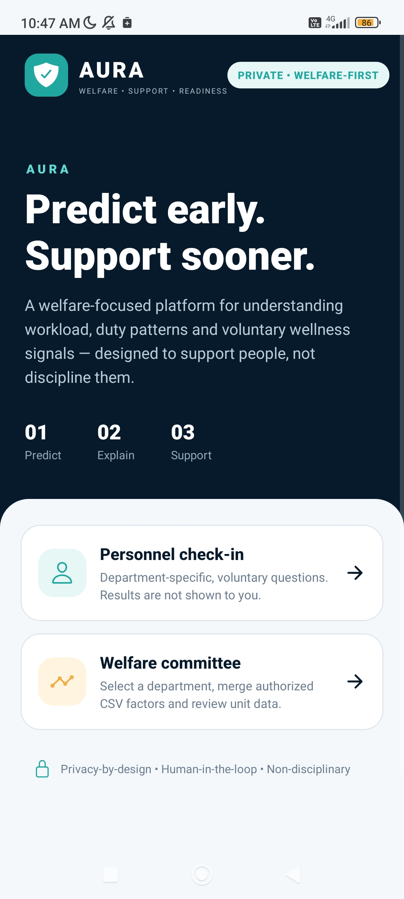
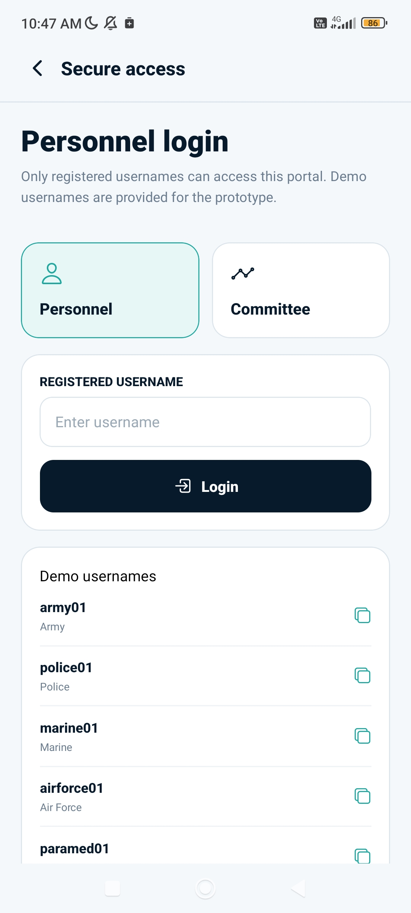
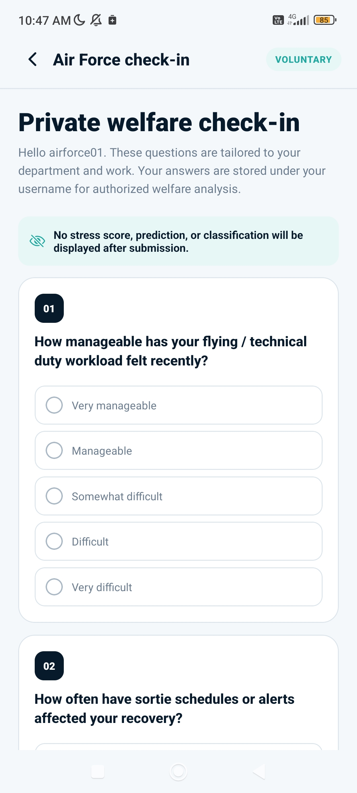
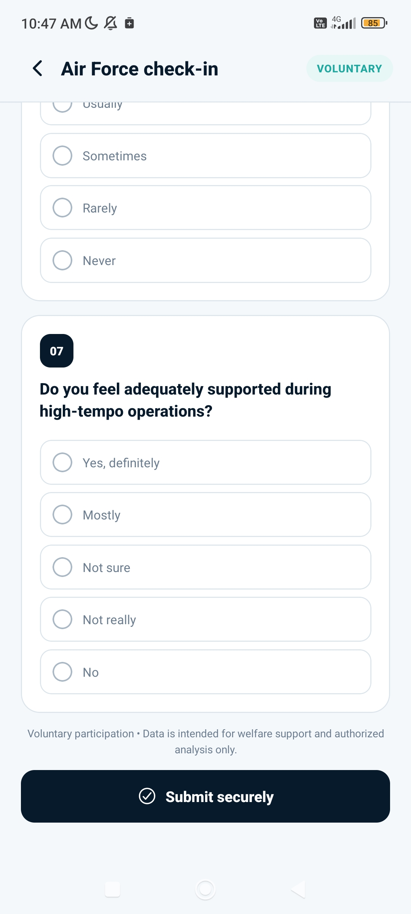
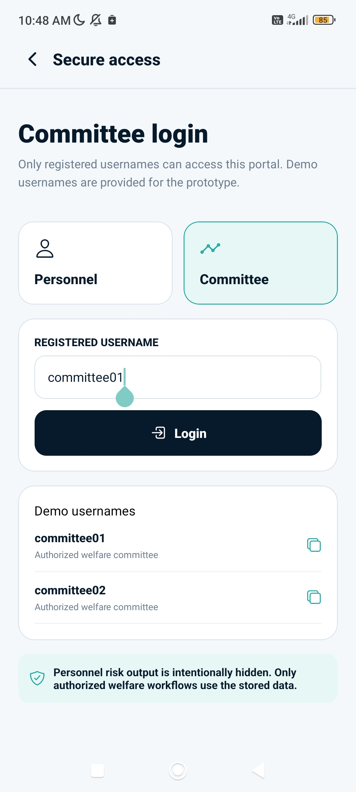
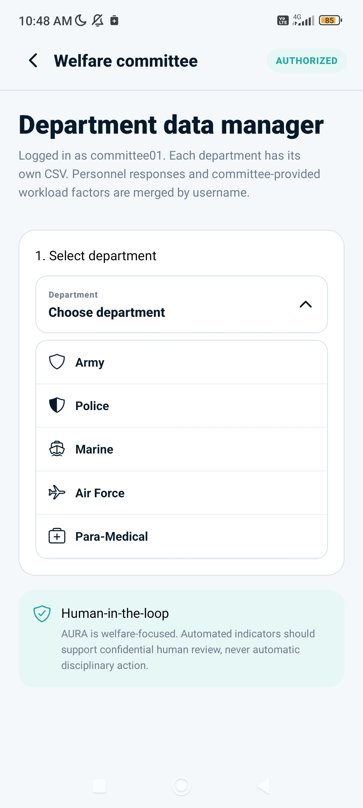
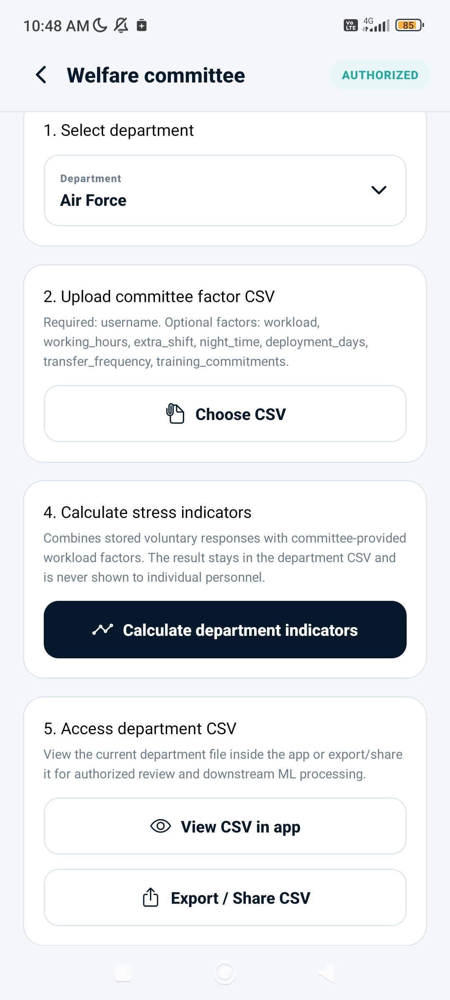
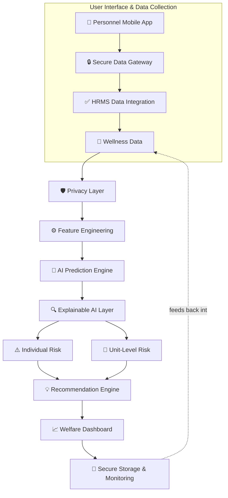

<div align="center">

# 🛡️ AURA
### AI for Understanding & Relief Assessment

**Predict early. Explain clearly. Support sooner.**

*Privacy-by-design · Human-in-the-loop · Non-disciplinary*

[](https://github.com/TanH32-clg/AURA-SIH-2026)
[](#problem-statement)
[](#problem-statement)
[](#team)

</div>

---

## Table of Contents

- [Problem Statement](#problem-statement)
- [Overview](#overview)
- [Why AURA](#why-aura--innovation--uniqueness)
- [App Walkthrough](#app-walkthrough)
  - [Landing Page](#1-landing-page)
  - [Personnel Login & Check-in](#2-personnel-login--check-in)
  - [Committee Login & Department Data Manager](#3-committee-login--department-data-manager)
- [System Architecture](#system-architecture)
- [Tech Stack](#tech-stack)
- [Role-Aware Feature Engineering](#role-aware-feature-engineering)
- [Security & Privacy](#security--privacy)
- [Fallback / Resilience Logic](#fallback--resilience-logic)
- [Feasibility & Viability](#feasibility--viability)
- [Expected Impact & Benefits](#expected-impact--benefits)
- [Repository Structure](#repository-structure)
- [Getting Started](#getting-started)
- [Backend ↔ Frontend Integration](#backend--frontend-integration)
- [Research & References](#research--references)
- [Team](#team)
- [The AURA Promise](#the-aura-promise)

---

## Problem Statement

| | |
|---|---|
| **Problem Statement ID** | SIH26186 |
| **Problem Statement Title** | AI-Based Predictive Personnel Stress and Welfare Monitoring System for Uniformed Forces |
| **Theme** | MedTech / BioTech / HealthTech |
| **PS Category** | Software |
| **Team ID** | 26RBU127 |
| **Team Name** | AURA (AI for Understanding & Relief Assessment) |

## Overview

Uniformed personnel — army, police, marine, air force, and para-medical staff — operate under duty loads, deployment patterns, and shift structures that make chronic stress and burnout hard to catch early through manual observation alone. Existing HR processes typically react only after a problem has already become visible: a missed shift, a disciplinary incident, an attrition request.

**AURA** is an AI-powered platform that analyzes workload, duty, deployment, and *voluntary* wellness patterns to predict early signs of stress and burnout — surfacing this to an authorized welfare committee with clear, explainable reasoning, so a confidential, human-led check-in can happen before a small strain becomes a crisis. It is explicitly **not** a surveillance or disciplinary tool: individual personnel never see a stress score or classification, and the system is designed so no automated output can trigger disciplinary action on its own.

## Why AURA — Innovation & Uniqueness

- **Innovation:** Predicts stress early from workload, duty, and voluntary wellness patterns using explainable AI — not a black-box score, but a reasoned, auditable output a human can actually evaluate.
- **Uniqueness:** Privacy-first, human-reviewed, and welfare-focused by design. The architecture actively prevents the two failure modes that kill trust in systems like this: individuals never see their own risk output (removing incentive to game the check-in), and the welfare committee sees reasons and recommendations, never raw grounds for punishment.

## App Walkthrough

### 1. Landing Page

The landing page sets expectations immediately — what AURA does, and what it deliberately does *not* do — before anyone logs in.



Two entry points are presented as equal, parallel paths:
- **Personnel check-in** — department-specific, voluntary questions. Results are not shown to the person who submits them.
- **Welfare committee** — select a department, merge authorized CSV factors, and review unit-level data.

The footer principle — *Privacy-by-design · Human-in-the-loop · Non-disciplinary* — is repeated throughout the app, not just stated once on this screen.

### 2. Personnel Login & Check-in

Access is username-based and role-scoped. The prototype ships demo usernames per department (`army01`, `police01`, `marine01`, `airforce01`, `paramed01`) so evaluators can walk through any department's flow without needing a real personnel directory.



Once logged in, the soldier sees a **department-specific** check-in — the questions asked to Air Force personnel (flight/technical duty workload, sortie schedule disruption to recovery, support during high-tempo operations) are different from what a Para-Medical or Police check-in would ask, because the sources of strain are different across roles.



Every question is voluntary and single-select. Critically, the check-in screen states outright — **before** any question is answered — that no stress score, prediction, or classification will ever be shown back to the person filling it in. This is a deliberate anti-surveillance design choice: the check-in exists to feed the welfare pipeline, not to hand a soldier a self-diagnosis, and not to let a chain of command infer someone "failed" a wellness check by demeanor.



Submission is explicit ("Submit securely") and the screen reiterates: *voluntary participation, data intended for welfare support and authorized analysis only.*

### 3. Committee Login & Department Data Manager

Welfare committee members log in through a separate, visually distinct flow from personnel — same underlying "Secure access" screen, but a different tab and a different consequence.



The committee login screen states the boundary in plain language: **"Personnel risk output is intentionally hidden. Only authorized welfare workflows use the stored data."** This is the same privacy boundary enforced at the architecture level (see [Security & Privacy](#security--privacy)), surfaced directly in the UI so it isn't just a backend implementation detail.

Once authenticated, the committee member becomes a **department data manager**:



Each department (Army, Police, Marine, Air Force, Para-Medical) has its own CSV. Personnel check-in responses and committee-provided workload factors are merged **by username**, not by any broader identifier — keeping the join surface as narrow as possible.



The department workflow is a straightforward four-step pipeline:
1. **Select department**
2. **Upload committee factor CSV** — username plus optional workload factors (`workload`, `working_hours`, `extra_shift`, `night_time`, `deployment_days`, `transfer_frequency`, `training_commitments`)
3. **Calculate department indicators** — combines the stored voluntary responses with the committee-provided workload factors. The result stays inside the department CSV and is never surfaced to individual personnel.
4. **Access department CSV** — view in-app or export/share for authorized review and downstream ML processing.

The **Human-in-the-loop** principle is stated directly on this screen: *"AURA is welfare-focused. Automated indicators should support confidential human review, never automatic disciplinary action."*

## System Architecture



Data flows one direction through prediction and explanation, and only individual/unit risk outputs — never raw responses — reach the welfare dashboard. The secure storage layer sits outside the personnel-facing app entirely; nothing about an individual's risk output round-trips back to the mobile app.

## Tech Stack

| Layer | Technology |
|---|---|
| **Frontend & Dashboard** | React Native, HTML5, CSS3, Bootstrap 5, JavaScript |
| **Backend & API** | Python, FastAPI |
| **Predictive Models** | Logistic Regression (interpretable baseline), Random Forest, XGBoost (tabular/HR data), Isolation Forest (unsupervised anomaly detection) |
| **Explainable AI** | SHAP (SHapley Additive exPlanations) for per-prediction risk transparency |
| **Security & Privacy** | AES-256 encryption at rest, 3-tier Role-Based Access Control (RBAC) |

## Role-Aware Feature Engineering

- **Common features across all departments:** duty load, leave utilization, workload, deployment duration, rest intervals, and voluntary wellness signals.
- **Role-specific features:** operational intensity, night shifts, patrol/incident exposure (Police), patient/case load (Para-Medical), sortie/flight scheduling (Air Force), and comparable department-specific deadlines and pressures.
- **Adaptive baselines:** each person is compared against others in similar roles/units rather than against one universal threshold — a duty load that's unremarkable for one department can be a meaningful spike for another.

## Security & Privacy

- **AES-256 encryption** for data at rest.
- **3-tier Role-Based Access Control (RBAC):** personnel, welfare committee, and (in the full deployment model) unit/central oversight each see a different slice of the system — never more than their role requires.
- **Privacy-by-design:** individual personnel never see their own stress score, prediction, or classification — the check-in UI states this explicitly before submission, not buried in a privacy policy.
- **Human-in-the-loop:** every automated indicator is designed to prompt a confidential human review, never to trigger an automatic consequence.
- **Non-disciplinary by architecture:** the department CSV pipeline keeps calculated indicators inside the welfare workflow; there's no path from a computed indicator back to a disciplinary or performance-review process.
- **Regulatory alignment:** designed with the Digital Personal Data Protection (DPDP) Act, 2023 in mind.

## Fallback / Resilience Logic

Built for the actual operating conditions of uniformed forces rather than an always-online office environment:

| Condition | Fallback |
|---|---|
| XGBoost unavailable | `HistGradientBoostingClassifier` (scikit-learn) |
| SHAP unavailable or too heavy for the device | Permutation-based feature importance |
| Remote posting / no continuous network | Local encrypted data capture with batch-sync windows once connectivity is available |

## Feasibility & Viability

| Category | Analysis of Feasibility | Potential Challenges & Risks |
|---|---|---|
| **Technical** | Uses proven web frameworks (Bootstrap/FastAPI) and open-source ML models. | Unlabeled real-world stress data, and the general "black-box" ML trust problem. |
| **Financial** | Low implementation cost. | Maintenance and hardware scaling for large military groups. |
| **Market** | High demand across CAPFs, State Police, and Armed Forces, with minimal existing competition. | Government and military organizations are often slow to adopt new technology. |
| **Operational** | Fits secure military networks, batch CSV exports, and doesn't interrupt daily field routines. | Low user trust, fear of disciplinary action, and survey fatigue among ground personnel. |

**Strategies for overcoming these challenges:**
- **Algorithms & methods** — SHAP explanations and unsupervised anomaly detection (catches patterns a fixed threshold would miss)
- **Principles & frameworks** — Privacy-by-design and DPDP Act 2023 compliance
- **Operational strategies** — Role-Based Access Control (RBAC)
- **System design** — Human-in-the-loop review by an authorized welfare committee

## Expected Impact & Benefits

```
Voluntary check-in + duty/workload data
        │
        ▼
Early risk trend + explainable drivers
        │
        ▼
Authorized committee review
        │
        ▼
Timely welfare support / workload adjustment
```

- **Social:** safer units, stronger morale, reduced stigma around seeking help.
- **Operational:** higher readiness and fewer field errors linked to unaddressed fatigue.
- **Organizational:** fairer workload distribution and improved retention.
- **Economic:** lower attrition and reduced medical downtime.

## Repository Structure

```
AURA-SIH-2026/
├── backend/          # Python/FastAPI backend + ML pipeline (this section documents it precisely)
├── frontend/         # React Native mobile app (personnel check-in + committee workflow, shown in the screenshots above)
└── README.md         # this file
```

## Getting Started

### Backend

```bash
cd backend
pip install -r requirements.txt
# On some systems: pip install -r requirements.txt --break-system-packages

# Generate the working dataset and artifacts, in order
python synthetic_data.py        # -> artifacts/raw_dataset.csv
python feature_engineering.py   # -> artifacts/features.csv
python models.py                # -> artifacts/model_*.joblib, metrics.json
python identity_registry.py     # -> artifacts/name_registry.enc.json, name_encryption.key
python risk_scoring.py          # -> sanity-checks the full pipeline end to end

# Start the backend
python -m uvicorn api:app --reload
# Swagger docs: http://127.0.0.1:8000/docs
```

`backend/dashboards/live_dashboard.html` is a standalone reference dashboard, not part of the mobile app — open it directly in a browser to exercise every endpoint below without needing the React Native app running. Useful for backend development, debugging, and demoing the ML pipeline in isolation.

### Frontend

```bash
cd frontend
npm install
# then whichever React Native run command this project is set up for,
# e.g. npx expo start, or npx react-native run-android
```

*(Exact frontend run steps should come from whoever set up that project — not documented here since this README is written from the backend side.)*

### API Reference — what `backend/` exposes for `frontend/` to call

| Endpoint | Method | Role(s) | Purpose |
|---|---|---|---|
| `/ingest/hr-csv` | POST | `central_committee` | Stream A — batch HR/deployment CSV upload |
| `/ingest/wellness-form` | POST | `soldier` | Stream B — one voluntary daily check-in |
| `/score/recompute` | POST | `central_committee`, `welfare_officer` | Merges both streams, runs all 4 models, recomputes every score |
| `/dashboard/units` | GET | `central_committee`, `unit_commander`, `welfare_officer` | Lists units the caller is allowed to see |
| `/dashboard/commander-overview` | GET | `central_committee`, `unit_commander` | Aggregated, anonymized risk by unit |
| `/dashboard/commander/{unit_id}` | GET | `central_committee`, `unit_commander` | Latest aggregated snapshot for one unit |
| `/dashboard/commander/{unit_id}/trend` | GET | `central_committee`, `unit_commander` | 14-day trend line for one unit |
| `/dashboard/welfare/high-risk` | GET | `central_committee`, `welfare_officer` | Top 5 individual risk cases, with SHAP reasons. Real names are decrypted **only** for `welfare_officer` — `central_committee` sees team IDs and reasons only |
| `/health` | GET | any | Liveness check |

Every request needs `x-user-id` and `x-user-role` headers (`x-unit-id` too, for `unit_commander`) — this is a lightweight RBAC stub, not a real auth system, so `frontend/` will need to replace this with tokens from whatever login flow the "Secure access" screen actually performs before this goes beyond a prototype (see [Backend ↔ Frontend Integration](#backend--frontend-integration) below).

### What's actually happening under the hood

- **Feature engineering** turns raw duty/leave/deployment records into: 7d/30d rolling workload spikes, a recovery-deficit ratio (high-intensity days vs. rest days), and a 14–21 day wellness-trajectory deviation from each person's own baseline — not a fixed threshold.
- **Four models, trained together:** Logistic Regression (auditable baseline), Random Forest, XGBoost (or `HistGradientBoostingClassifier` if XGBoost isn't installed), and an unsupervised Isolation Forest trained only on wellness-trajectory features — it needs no risk label at all, so it can catch a pattern the other three were never trained to expect.
- **Composite score:** 70% average of the three supervised models' probabilities + 30% Isolation Forest anomaly percentile, scaled to 0–100.
- **Explainability:** SHAP `TreeExplainer` on the gradient-boosted model generates the top reasons per person; falls back to a leave-one-out perturbation method if SHAP isn't installed, so the pipeline degrades instead of breaking.
- **Missing wellness data is handled explicitly, not silently:** a person with partial check-in gaps gets their own recent history filled in; a person with **zero** check-ins for the whole window (an incommunicado posting, for instance) falls back to a population-wide median so scoring never fails for them — and a `wellness_data_coverage` field flags that their score leans on organizational data alone, so a welfare officer isn't misled into thinking it's a fully-informed score.
- **Names are encrypted at rest with real AES-256-GCM**, not a toy cipher — one random nonce per name, key stored separately from the ciphertext. The decrypt function is called from exactly one code path in the whole API (the welfare-officer-gated endpoint), so there's no path by which a bug elsewhere could leak a name.

## Backend ↔ Frontend Integration

`backend/` and `frontend/` were built somewhat independently, so there are real integration decisions left before they're one working system rather than two working halves:

- **Department vs. unit.** `frontend/` organizes personnel by **department** (Army, Police, Marine, Air Force, Para-Medical). `backend/` organizes them by **unit** (`UNIT-001`, `UNIT-002`, ...). Someone needs to decide whether a department *is* a unit for scoring purposes, or whether each department contains several units — this determines what value the frontend sends as `unit_id` when its CSV reaches `/ingest/hr-csv`.
- **Auth.** The "Secure access" login screen in `frontend/` will need to produce whatever `x-user-id`/`x-user-role` values `backend/` expects (see the API reference above) — right now the backend trusts these headers directly with no token verification, which is fine for a hackathon demo but is the first thing to harden if this goes further.
- **Department-specific check-in questions.** Each department's form in `frontend/` (only the Air Force version is shown in this README, since that's the only one in the screenshots I was given) asks different questions, but all of them need to ultimately map to the six fields `/ingest/wellness-form` expects: `sleep_hours`, `sleep_quality`, `fatigue_level`, `energy_level`, `mood_score`, `stress_perception`. That mapping — which department question feeds which field — lives on the frontend side and isn't something the backend needs to know about, but it does need to exist somewhere before real data flows end to end.


## Research & References

- Governing algorithms, empowering people: how ethical AI oversight shapes trust, technostress, and employee autonomy in AI-enabled HRM (2026)
- Digital Personal Data Protection (DPDP) Act, 2023
- WHO Guidelines on Mental Health at Work (2022)
- BPR&D Studies on CAPF Stress
- NIMHANS Guidelines for Occupational Mental Health
- Mental Health Stigma and Help-Seeking Intentions in Police Employees (2023)
- Attrition in Central Armed Police Forces
- An epidemiologic study of occupational stress factors in Mumbai police personnel

## Team

**Team ID:** 26RBU127 · **Team Name:** AURA

**Team Members**
1. Tanmay Hedaoo
2. Pratik Poddar
3. Sadhana Deogaonkar
4. Ipshita Yadav
5. Aryan Lanjewar
6. Harshal Butolia

**Mentors**
1. Prof. Rasika Rewatkar
2. Dr. Sourabh Tiwari

---

## The AURA Promise

<div align="center">

**Predict early. Explain clearly. Support sooner.**

*Privacy-by-design · Human-in-the-loop · Non-disciplinary*

🇮🇳 **JAI HIND** — Serving those who serve the nation.

</div>
